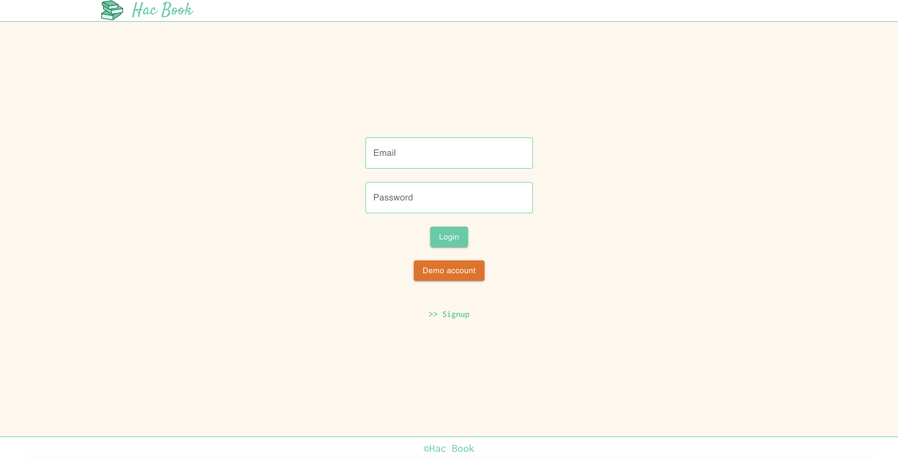
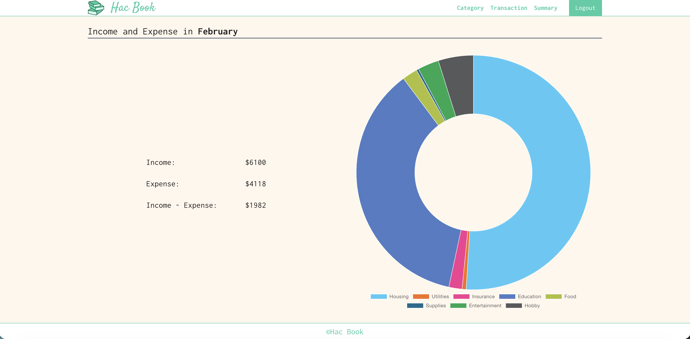
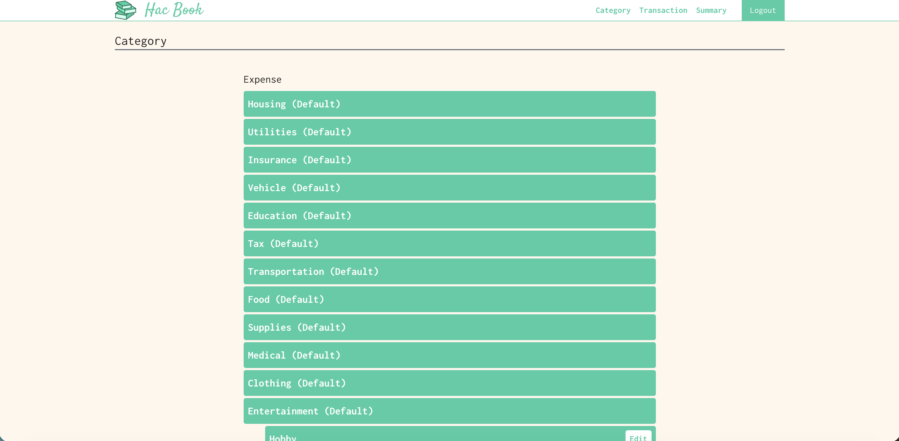
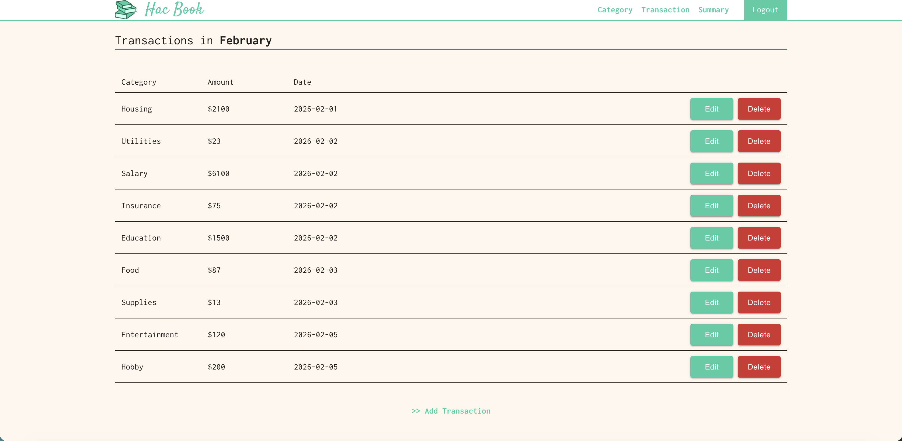

# Hac Book (Frontend)

This is the frontend application for a personal household accounting system.
Users can record income and expenses, manage categories, and view summaries
through a clean and responsive UI.

## Features

- User authentication (login / logout / signup)
- Dashboard
  - Monthly income / expense summary
  - Expense breakdown by category
- Transaction management
  - Create / edit / delete income and expense records
  - Filter by date range
- Category management
  - Parent-child category structure

### Login


### Dashboard


### Transactions


### Categories


> All screenshots are taken in desktop view.
> The application is fully responsive and supports mobile devices.

## Tech Stack

- React
- Next.js (App Router)
- TypeScript
- Tailwind CSS
- Fetch API
- React Hook Form

## Architecture

- App Router based routing
- Component-based design
- API communication via REST
- Authentication handled by HttpOnly cookies
- Server-side authentication check

## Backend Integration

This frontend communicates with the backend REST API.
Authentication is handled via JWT stored in HttpOnly cookies.

Backend repository:
👉 [Hac Book API](https://github.com/katsu0511/hac_book_api)

## Getting Started

```bash
npm install
npm run dev
```

Create ```.env```:

```
NEXT_PUBLIC_API_BASE_URL=http://localhost:8080
```

## Future Improvements

- Improve loading and error handling UX
- Add chart animations
- Responsive optimization for mobile
- Develop mobile apps (iOS / Android)
